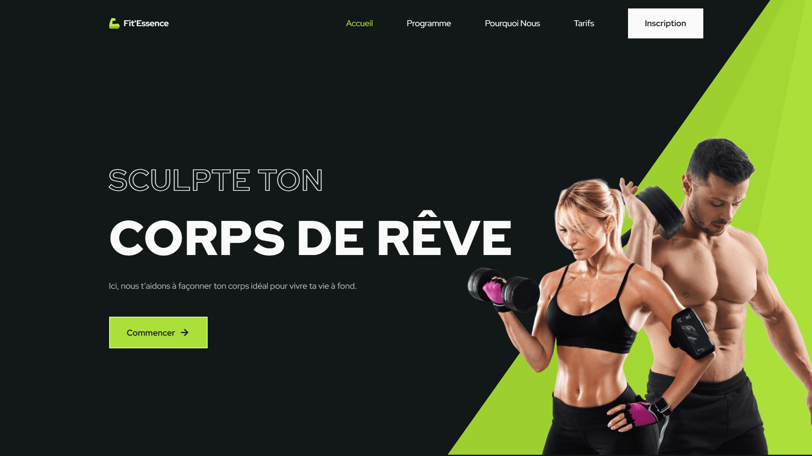

<div align="center">  
    <a href="https://fitness-center-vm.netlify.app/" target="_blank">  
        
    </a>
    </br>  
    </br>  
  <h3 align="center">💪 Fit'Essence &nbsp; — &nbsp; Salle de Sport </h3>  
</div>

## <br /> 📌 Sommaire

&nbsp;&nbsp;&nbsp; 🎨 &nbsp; [**Introduction**](#introduction)<br />
&nbsp;&nbsp;&nbsp; 🛠️ &nbsp; [**Technologies**](#technologies)<br />
&nbsp;&nbsp;&nbsp; 🎯 &nbsp; [**Fonctionnalités**](#fonctionnalités)<br />
&nbsp;&nbsp;&nbsp; 🚀 &nbsp; [**Installation**](#installation)<br />

## <br /> <a name="introduction">🎨 Introduction</a>

Fit'Essence est une landing page immersive et sombre pour salle de sport, conçue pour promouvoir des offres de coaching, des programmes variés et un calculateur d’IMC. Le site combine esthétique, performance et interactivité pour attirer et convertir les visiteurs.

## <br /> <a name="technologies">🛠️ Technologies</a>

- HTML5 sémantique et structuration claire
- CSS3 moderne avec variables, media queries et animations
- JavaScript ES6 clair et modulaire
- [ScrollReveal](https://scrollrevealjs.org/) pour des animations au scroll
- [Remix Icons](https://remixicon.com/) pour des icônes vectorielles modernes
- Responsive Design pensé en mobile-first

## <br /> <a name="fonctionnalités">🎯 Fonctionnalités</a>

- Programmes muscu, cardio, yoga, haltéro
- Calculateur d’IMC interactif avec feedback personnalisé
- Offres tarifaires dynamiques avec forfaits différenciés
- Formulaire d’abonnement connecté à EmailJS
- Menu mobile responsive avec animation
- Animations fluides avec ScrollReveal
- Lien actif dynamique sur la navigation
- Triangles et effets visuels modernes
- Bandeau de logos partenaires
- Design full responsive pensé mobile-first

## <br /> <a name="installation">🚀 Installation</a>

### ✅ Prérequis

- [Google Chrome](https://www.google.com/) &nbsp;—&nbsp; Navigateur moderne
- [Visual Studio Code](https://code.visualstudio.com/) &nbsp;—&nbsp; Éditeur de code
- [Live Server](https://marketplace.visualstudio.com/items?itemName=ritwickdey.LiveServer) &nbsp;—&nbsp; Extension VS Code

### 📥 Cloner le projet

```bash
git clone git@github.com:ValentinMadiot/fitness-center_ui
cd fitness-center_ui
```

### ▶️ Lancer le projet

Il suffit d’ouvrir le fichier `index.html` dans un navigateur, ou d’utiliser l’extension **Live Server** sur VS Code pour un aperçu dynamique.
